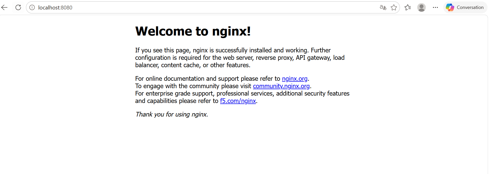

PS C:\Users\victo\Desktop\tp_docker> docker pull nginx      
Using default tag: latest
latest: Pulling from library/nginx
3fe5ab3f8614: Download complete
3fe5ab3f8614: Pull complete
0478569e858e: Pull complete
ab606a349520: Pull complete
c06193164a25: Pull complete
6310eb16bf42: Pull complete
76225461b7d3: Pull complete
59379d3e12b2: Download complete
d18f12d40fc4: Download complete
Digest: sha256:d0d674272be3be36f9a13d79194fa0db5aa630ab3ede9bec459d12f67370aaef
Status: Downloaded newer image for nginx:latest
docker.io/library/nginx:latest

PS C:\Users\victo\Desktop\tp_docker> docker run -d -p 8080:80 --name mon_nginx nginx
35d3879e649d2c62f8ec59b11fb7b3deca516f898ac8cfe18740fef92dd6c903

PS C:\Users\victo\Desktop\tp_docker> docker ps
CONTAINER ID   IMAGE     COMMAND                  CREATED          STATUS          PORTS                                     NAMES
35d3879e649d   nginx     "/docker-entrypoint.…"   19 seconds ago   Up 17 seconds   0.0.0.0:8080->80/tcp, [::]:8080->80/tcp   mon_nginx

PS C:\Users\victo\Desktop\tp_docker> docker stop mon_nginx
mon_nginx

PS C:\Users\victo\Desktop\tp_docker> docker rm mon_nginx   
mon_nginx

PS C:\Users\victo\Desktop\tp_docker> docker ps -a       
CONTAINER ID   IMAGE     COMMAND   CREATED   STATUS    PORTS     NAMES

