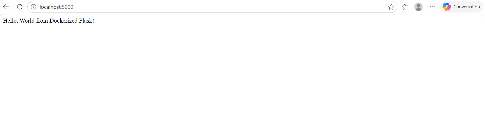

PS C:\Users\victo\Desktop\tp_docker> cd flask_app

PS C:\Users\victo\Desktop\tp_docker\flask_app> docker build -t mon_app_flask .
[+] Building 16.4s (11/11) FINISHED                                                                                            docker:desktop-linux
=> [internal] load build definition from Dockerfile                                                                                           0.1s
=> => transferring dockerfile: 569B                                                                                                           0.0s
=> [internal] load metadata for docker.io/library/python:3.9-slim                                                                             1.9s
=> [auth] library/python:pull token for registry-1.docker.io                                                                                  0.0s
=> [internal] load .dockerignore                                                                                                              0.1s
=> => transferring context: 2B                                                                                                                0.0s
=> [1/5] FROM docker.io/library/python:3.9-slim@sha256:2d97f6910b16bd338d3060f261f53f144965f755599aab1acda1e13cf1731b1b                       5.0s
=> => resolve docker.io/library/python:3.9-slim@sha256:2d97f6910b16bd338d3060f261f53f144965f755599aab1acda1e13cf1731b1b                       0.1s
=> => sha256:ea56f685404adf81680322f152d2cfec62115b30dda481c2c450078315beb508 251B / 251B                                                     0.2s
=> => sha256:fc74430849022d13b0d44b8969a953f842f59c6e9d1a0c2c83d710affa286c08 13.88MB / 13.88MB                                               1.6s
=> => sha256:b3ec39b36ae8c03a3e09854de4ec4aa08381dfed84a9daa075048c2e3df3881d 1.29MB / 1.29MB                                                 0.9s
=> => sha256:38513bd7256313495cdd83b3b0915a633cfa475dc2a07072ab2c8d191020ca5d 29.78MB / 29.78MB                                               2.5s
=> => extracting sha256:38513bd7256313495cdd83b3b0915a633cfa475dc2a07072ab2c8d191020ca5d                                                      1.0s
=> => extracting sha256:b3ec39b36ae8c03a3e09854de4ec4aa08381dfed84a9daa075048c2e3df3881d                                                      0.2s
=> => extracting sha256:fc74430849022d13b0d44b8969a953f842f59c6e9d1a0c2c83d710affa286c08                                                      0.7s
=> => extracting sha256:ea56f685404adf81680322f152d2cfec62115b30dda481c2c450078315beb508                                                      0.0s
=> [internal] load build context                                                                                                              0.2s
=> => transferring context: 464B                                                                                                              0.0s
=> [2/5] WORKDIR /app                                                                                                                         0.8s
=> [3/5] COPY requirements.txt .                                                                                                              0.1s
=> [4/5] RUN pip install --no-cache-dir -r requirements.txt                                                                                   6.2s
=> [5/5] COPY app.py .                                                                                                                        0.2s
=> exporting to image                                                                                                                         1.7s
=> => exporting layers                                                                                                                        0.9s
=> => exporting manifest sha256:bd93952bcc75d61405172e811f3de1b7d34db16ad68739c13c6fec582a6d6e52                                              0.0s
=> => exporting config sha256:df36ccfbf368c9c4c4a1d69ab83138bbda4831ebb9d6509e75bf33a46be0c324                                                0.0s
=> => exporting attestation manifest sha256:71de0deda00df8d0bc2def83b6b659e175cae3abc625cd133987dc9b5c16d43a                                  0.1s
=> => exporting manifest list sha256:8722045dac2e9e1aa36b2c7969c690930e46bb8bd50924ddb7867d7a0b4938d8                                         0.0s
=> => naming to docker.io/library/mon_app_flask:latest                                                                                        0.0s
=> => unpacking to docker.io/library/mon_app_flask:latest                                                                                     0.4s

PS C:\Users\victo\Desktop\tp_docker\flask_app> docker images                                                                                        
i Info →   U  In Use
IMAGE                  ID             DISK USAGE   CONTENT SIZE   EXTRA
mon_app_flask:latest   8722045dac2e        200MB         48.8MB        
nginx:latest           d0d674272be3        253MB         69.2MB

PS C:\Users\victo\Desktop\tp_docker\flask_app> docker run -d -p 5000:5000 --name conteneur_flask mon_app_flask
b657f0c9008cf1f26506517421df945263d43ca54935e932e2f9aedd56e5ae16

PS C:\Users\victo\Desktop\tp_docker\flask_app> docker ps
CONTAINER ID   IMAGE           COMMAND           CREATED          STATUS          PORTS                                         NAMES
b657f0c9008c   mon_app_flask   "python app.py"   14 seconds ago   Up 13 seconds   0.0.0.0:5000->5000/tcp, [::]:5000->5000/tcp   conteneur_flask

PS C:\Users\victo\Desktop\tp_docker\flask_app> docker stop conteneur_flask
conteneur_flask

PS C:\Users\victo\Desktop\tp_docker\flask_app> docker rm conteneur_flask
conteneur_flask

