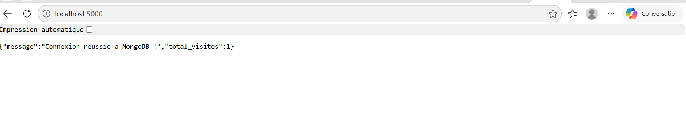

PS C:\Users\victo\Desktop\tp_docker> docker compose up -d --build
[+] Building 12.3s (13/13) FINISHED                                                                                                                 
=> [internal] load local bake definitions                                                                                                     0.1s
=> => reading from stdin 551B                                                                                                                 0.1s
=> [internal] load build definition from Dockerfile                                                                                           0.0s
=> => transferring dockerfile: 569B                                                                                                           0.0s
=> [internal] load metadata for docker.io/library/python:3.9-slim                                                                             1.0s
=> [auth] library/python:pull token for registry-1.docker.io                                                                                  0.0s
=> [internal] load .dockerignore                                                                                                              0.1s
=> => transferring context: 2B                                                                                                                0.0s
=> [1/5] FROM docker.io/library/python:3.9-slim@sha256:2d97f6910b16bd338d3060f261f53f144965f755599aab1acda1e13cf1731b1b                       0.1s
=> => resolve docker.io/library/python:3.9-slim@sha256:2d97f6910b16bd338d3060f261f53f144965f755599aab1acda1e13cf1731b1b                       0.1s
=> [internal] load build context                                                                                                              0.2s
=> => transferring context: 1.39kB                                                                                                            0.0s
=> CACHED [2/5] WORKDIR /app                                                                                                                  0.0s
=> [3/5] COPY requirements.txt .                                                                                                              0.1s
=> [4/5] RUN pip install --no-cache-dir -r requirements.txt                                                                                   7.8s
=> [5/5] COPY app.py .                                                                                                                        0.1s
=> exporting to image                                                                                                                         2.0s
=> => exporting layers                                                                                                                        1.1s
=> => exporting manifest sha256:507813e58601730b7494e597363876eb9f335b4f23b24eba1f63e78ebd6e6d9a                                              0.0s
=> => exporting config sha256:f9d4145b5a4d590d1f28987f0178a3bb6c6d44215a42b61ff51bc6dbb1f0c8e8                                                0.0s
=> => exporting attestation manifest sha256:222ef2a56a89b84c129481bc3973f0051ff18696ee2a94177a5b85b690546d89                                  0.0s
=> => exporting manifest list sha256:6a36a3d29d26607a248b3dc9061d2800c68f5affc35d46e07a98077103c3d12f                                         0.0s
=> => naming to docker.io/library/tp_docker-web:latest                                                                                        0.0s
=> => unpacking to docker.io/library/tp_docker-web:latest                                                                                     0.6s
=> resolving provenance for metadata file                                                                                                     0.0s
[+] up 5/5                                                                                                                                          
✔ Image tp_docker-web           Built                                                                                                         18.3s
✔ Network tp_docker_default     Created                                                                                                        0.1s
✔ Volume tp_docker_mongo_data   Created                                                                                                        0.0s
✔ Container conteneur_mongo     Started                                                                                                        1.2s
✔ Container conteneur_web_flask Started                                                                                                        1.1s

PS C:\Users\victo\Desktop\tp_docker> docker compose ps           
NAME                  IMAGE           COMMAND                  SERVICE   CREATED              STATUS              PORTS
conteneur_mongo       mongo:6.0       "docker-entrypoint.s…"   mongodb   About a minute ago   Up About a minute   0.0.0.0:27017->27017/tcp, [::]:27017->27017/tcp
conteneur_web_flask   tp_docker-web   "python app.py"          web       About a minute ago   Up About a minute   0.0.0.0:5000->5000/tcp, [::]:5000->5000/tcp

PS C:\Users\victo\Desktop\tp_docker> docker compose logs web
conteneur_web_flask  |  * Serving Flask app 'app'
conteneur_web_flask  |  * Debug mode: off
conteneur_web_flask  | WARNING: This is a development server. Do not use it in a production deployment. Use a production WSGI server instead.
conteneur_web_flask  |  * Running on all addresses (0.0.0.0)
conteneur_web_flask  |  * Running on http://127.0.0.1:5000
conteneur_web_flask  |  * Running on http://172.18.0.3:5000
conteneur_web_flask  | Press CTRL+C to quit
conteneur_web_flask  | 172.18.0.1 - - [18/Sep/2026 13:08:24] "GET / HTTP/1.1" 200 -
conteneur_web_flask  | 172.18.0.1 - - [18/Sep/2026 13:08:24] "GET /favicon.ico HTTP/1.1" 404 -

PS C:\Users\victo\Desktop\tp_docker> docker compose down    
[+] down 3/3
✔ Container conteneur_web_flask Removed                                                                                                        3.4s
✔ Container conteneur_mongo     Removed                                                                                                        0.4s
✔ Network tp_docker_default     Removed     
